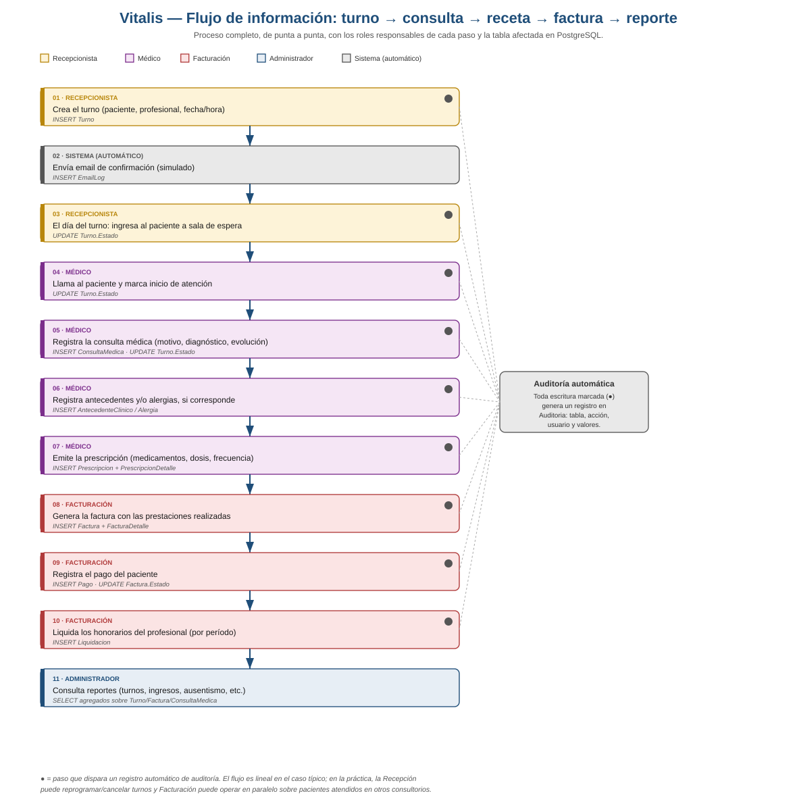

# Análisis de flujo de información

Este documento complementa [07-estado-actual-del-sistema.md](07-estado-actual-del-sistema.md)
con la mirada que suele pedirse en una tesina de Analista de Sistemas: no solo qué hace
cada módulo, sino **cómo viaja la información entre los actores, las pantallas y la base
de datos** a lo largo del proceso completo del consultorio.

## 1. Diagrama de flujo principal

El diagrama de arriba (`diagrams/flujo-informacion.svg` / `.png`) traza el camino completo
de un paciente por el sistema, paso a paso, indicando quién ejecuta cada acción, qué tabla
de PostgreSQL se ve afectada, y qué pasos generan automáticamente un registro de auditoría.

## 2. Lectura del flujo, por etapa

### 2.1 Agenda (Recepción)

La Recepcionista crea el turno indicando paciente, profesional y horario. El sistema
valida (`TurnoService.ValidarLógicaComplejaTurnoAsync`) que la fecha no sea pasada, que
caiga en día y horario hábil, y que no se superponga con otro turno del mismo profesional
ni con un bloqueo de agenda vigente. Si pasa la validación, se inserta el `Turno` con
estado inicial `"Solicitado"` y se dispara un email de confirmación simulado
(`EmailLog`), que el sistema registra en base de datos en lugar de enviarlo a un proveedor
real de correo (ver [01-vision-y-alcance.md](01-vision-y-alcance.md), fuera de alcance).

### 2.2 Sala de espera (Recepción → Médico)

El día del turno, la Recepcionista marca el ingreso del paciente a la sala de espera
(cambia `Turno.Estado`). El profesional, desde su propia pantalla, ve la cola de pacientes
en espera y marca el inicio de la atención — la misma tabla `Turno` es leída y escrita por
dos roles distintos en momentos distintos, que es exactamente el problema de coordinación
que el módulo de sala de espera busca resolver (reemplaza la planilla en papel mencionada
como problema en la visión del proyecto).

### 2.3 Consulta médica (Médico)

Al atender al paciente, el profesional registra la consulta (`ConsultaMedica`): motivo,
diagnóstico, evolución e indicaciones, vinculada al `Turno` de origen. Desde la misma
pantalla puede cargar antecedentes clínicos y alergias del paciente si es la primera vez
que se registran. Esta es la información más sensible del sistema (datos de salud), y es
también el motivo por el cual `ConsultasMedicasController` está restringido a los roles
`Administrador` y `Médico` — ni Recepción ni Facturación pueden leerla.

### 2.4 Prescripción (Médico)

Si la consulta lo requiere, el médico emite una prescripción asociada a la consulta:
medicamento, dosis, frecuencia y duración. El detalle se guarda en una tabla hija
(`PrescripcionDetalle`) porque una prescripción puede incluir varios medicamentos.

### 2.5 Facturación (Facturación)

Con la consulta ya registrada, Facturación genera la factura del paciente sobre las
prestaciones efectivamente realizadas (por ejemplo, "Consulta Médica General" +
"Electrocardiograma"), calculando el total como suma de subtotales. Los pagos se registran
por separado y pueden ser parciales; el estado de la factura (`Pendiente` / `Pago Parcial`
/ `Pagada`) se recalcula en cada pago nuevo comparando lo pagado acumulado contra el total.

### 2.6 Liquidación (Facturación / Administración)

Periódicamente se liquidan los honorarios de cada profesional: el sistema busca los turnos
atendidos por ese profesional en el período indicado y aplica un porcentaje según la obra
social de cada paciente (distinto según convenio), generando una `Liquidacion`.

### 2.7 Reportes (Administración)

El módulo de reportes no genera datos nuevos: **consume** en modo lectura los datos
producidos por todos los pasos anteriores (turnos por período, ausentismo, ingresos,
prestaciones más realizadas) para dar visibilidad de gestión. Es el motivo por el cual está
restringido a `Administrador`: agrega información clínica y financiera de todos los
pacientes y profesionales a la vez.

### 2.8 Auditoría (transversal)

Cada operación de escritura del flujo (creación de turno, cambio de estado, alta de
consulta, prescripción, factura, pago, liquidación) pasa por el mismo punto único:
`VitalisDbContext.SaveChangesAsync`, que antes de confirmar la transacción intercepta los
cambios pendientes y genera un registro en `Auditoria` con la tabla afectada, la acción
(`CREAR` / `MODIFICAR` / `ELIMINAR`), los valores anteriores y nuevos en JSON, y el usuario
autenticado que la ejecutó. Es un único punto de intercepción para todo el sistema, en
lugar de tener que agregar el registro de auditoría manualmente en cada servicio — esto es
un buen argumento técnico para la defensa: muestra uso de un patrón (interceptor a nivel de
framework) en lugar de repetir código.

## 3. Quién produce y quién consume cada dato

| Dato | Se origina en | Se consume en |
|---|---|---|
| Paciente | Recepción / Administración (alta) | Turnos, Consultas, Prescripciones, Facturación, Reportes |
| Turno | Recepción (alta) | Sala de espera, Consulta médica, Liquidación, Reportes |
| Consulta médica | Médico | Historial clínico del paciente, Prescripciones, Reportes (diagnósticos frecuentes) |
| Prescripción | Médico | Historial de recetas del paciente (no se re-consume en otro módulo) |
| Factura / Pago | Facturación | Reportes (ingresos por período), estado de deuda del paciente |
| Liquidación | Facturación/Administración, a partir de Turnos con consulta | Reportes (no hay pantalla de "pago al profesional" en el alcance actual) |
| Auditoría | Automático, a partir de cualquier escritura | Pantalla de Auditorías (solo Administrador) |

Esta tabla es el tipo de insumo que suele pedirse en el capítulo de "análisis del sistema"
de la tesina: deja explícito que el sistema no es un conjunto de pantallas sueltas, sino un
flujo donde cada módulo alimenta al siguiente.

## 4. Flujo de autenticación (transversal a todo lo anterior)

Cada paso del flujo principal requiere, primero, que el usuario esté autenticado. Ese
flujo está documentado en detalle en el diagrama de arquitectura
([diagrams/arquitectura.svg](diagrams/arquitectura.svg)): el cliente Angular envía
credenciales a `POST /api/auth/login`, el backend verifica el hash de la contraseña
(BCrypt) contra `Usuario.PasswordHash`, y si es válido devuelve un token JWT firmado que
incluye el rol del usuario como claim. Ese token viaja en el header `Authorization` de cada
request siguiente (vía `AuthInterceptor` en Angular) y el backend lo valida y extrae el rol
en cada endpoint para decidir si autoriza la operación — es el mecanismo que sostiene toda
la matriz de permisos documentada en la sección 2 de
[07-estado-actual-del-sistema.md](07-estado-actual-del-sistema.md).
